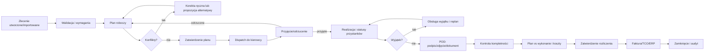

# TaxOrder Pro — architektura zintegrowanego centrum operacyjnego

Status: **projekt do zatwierdzenia**  
Data: 31.08.2026  
Zakres: Etap 1 — analiza i architektura, bez migracji i implementacji produkcyjnej

## 1. Decyzja wykonawcza

TaxOrder nie potrzebuje następnego niezależnego modułu. Potrzebuje warstwy orkiestracji, która połączy istniejące funkcje w jeden proces i jedno miejsce pracy.

Pierwszym pionem będzie:

```text
zlecenie → plan → przydział → dispatch → realizacja → POD → rozliczenie → eksport ERP
```

Źródłem prawdy procesu pozostanie rozszerzone `transport_orders`. Obecne moduły pojazdów, kierowców, mapy, PWA, Smart Forms, dokumentów, kosztów tras, faktur, TCO, zatwierdzeń i integracji zostaną ponownie użyte. Nowa warstwa nie może kopiować ich danych.

## 2. Stan obecny — mapa funkcji i przepływów

| Zdolność | Istniejące elementy | Stan integracji |
|---|---|---|
| Rejestr zleceń | `transport_orders`, `modules/transport-orders.js`, e-mail → zlecenie | CRUD; prosty status; brak etapów, przystanków i historii |
| Planowanie | `fleet-calendar`, `fleet-gantt`, `driver-schedule`, rezerwacje | wiele osobnych kalendarzy; brak wspólnego detektora konfliktów |
| Przydział | pola kierowcy i pojazdu w `transport_orders` | ręczny tekst/ID; brak wersji planu i walidacji ograniczeń |
| Trasy | route cost, route profitability, mapa, GPS, geofencing | kalkulacje i podglądy oddzielone od zlecenia |
| Kierowca mobilny | `driver-pwa`, `driver-panel`, komunikator | osobne `driver_trips`; brak wiążącego dispatchu z `transport_orders` |
| POD i formularze | Smart Forms, protokoły, podpis, zdjęcia, dokumenty R2 | zdolności istnieją; brak relacji POD → zlecenie |
| Dokumenty | `documents`, Document Manager, Doc Workflow, R2, OCR | dojrzałe; brakuje uniwersalnych powiązań encji |
| Koszt trasy | `route_cost_profiles`, Route Cost, TCO | kalkulator; brak zamrożonego planu i rzeczywistego rozliczenia zlecenia |
| Przychód/faktura | `route_invoices`, Route Billing, KSeF | osobny ekran; `order_id` istnieje, lecz cykl nie jest wymuszony |
| Zatwierdzenia | `approvals`, poziomy | ogólny mechanizm; brak jednolitych polityk i zdarzeń domenowych |
| Integracje | API keys, webhooki, `integration_settings`, log synchronizacji, folder monitor | osobne implementacje per dostawca; brak kontraktu adaptera i wspólnej kolejki |
| Import | CSV/XLSX pojazdów, paliwo, e-TOLL, DR, dokumenty, folder monitor | duplikowane kreatory; brak wspólnych profili mapowania i dry-run |
| Eksport | CSV/XLSX/JSON/XML/PDF, FK/JPK | rozproszone; brak jednego kreatora i harmonogramu |
| Raportowanie | Reports, Report Builder, KPI, TCO | Report Builder oparty na whitelistach; brak relacyjnego modelu semantycznego |
| Audyt | `audit_logs`, doc history, logi synchronizacji | kilka osi historii zamiast jednego standardu zdarzeń |

## 3. Główne problemy architektoniczne

1. Ten sam proces jest rozłożony na wiele ekranów bez wspólnego identyfikatora i osi czasu.
2. `transport_orders`, `driver_trips`, harmonogram kierowcy i faktura trasy mają luźne lub tekstowe powiązania.
3. Brakuje modelu przystanków, zadań, okien czasowych, wymagań i POD.
4. Status jest nadpisywanym polem, a nie skutkiem jawnych zdarzeń.
5. Integracje implementują własne logi, retry, mapowanie i deduplikację.
6. Importy są silosami domenowymi; użytkownik nie ma jednego bezpiecznego kreatora.
7. Kontrahenci występują jako klienci CFM, dostawcy, przewoźnicy i tekstowe nazwy.
8. Dokumenty są dobre jako repozytorium, ale słabsze jako uniwersalny uczestnik procesu.
9. Nawigacja odzwierciedla moduły techniczne, nie zadania użytkownika.

## 4. Docelowy pulpit operacyjny

Pulpit ma być powierzchnią roboczą, nie kolejnym dashboardem.

### Widoki

- **Co wymaga reakcji** — konflikty, SLA, wyjątki, brak dokumentu, zatwierdzenia, błędy integracji.
- **Dzisiaj** — oś czasu zleceń, pojazdów i kierowców.
- **Planowanie** — kolejka zleceń, zasoby, mapa, Gantt i propozycje przydziałów.
- **Realizacja** — aktywne operacje, ETA, status kierowcy, wyjątki i kontakt.
- **Do rozliczenia** — brakujące POD/dokumenty, koszty, faktury i eksport ERP.
- **Integracje** — stan konektorów, kolejki, błędy, retry i importy oczekujące na decyzję.

### Szybkie akcje

- nowe zlecenie/import zleceń;
- zaplanuj i przydziel;
- wyślij do kierowcy;
- zgłoś wyjątek/awarię;
- odbierz lub zweryfikuj POD;
- zatwierdź koszt;
- zamknij i rozlicz;
- eksportuj/synchronizuj.

## 5. Główny proces



### Stany nadrzędne

`draft → validated → planned → dispatched → accepted → in_progress → completed → settlement_pending → settled → closed`

Stany wyjątkowe: `blocked`, `rejected`, `cancelled`. Zmiana stanu następuje przez komendę i zapis zdarzenia, nie przez dowolną edycję selecta.

## 6. Granice odpowiedzialności

| TaxOrder | ERP/FK | Telematyka/sprzęt |
|---|---|---|
| zlecenia, zasoby, plan, przydział, status operacyjny, dokumenty, POD, koszty operacyjne, zatwierdzenia, TCO, audyt, mapowania | księga główna, plan kont, rozrachunki, płatności, podatkowe księgowanie, zamknięcia okresów | pozycje GPS, CAN/OBD, DTC, paliwo z czujników, TPMS, video, temperatura, zdarzenia jazdy |
| przygotowuje dokument/pozycję do synchronizacji | potwierdza numer dokumentu i stan księgowania/płatności | dostarcza obserwacje z czasem, jakością i identyfikatorem urządzenia |
| obsługuje wyjątek biznesowy i decyzję człowieka | jest źródłem prawdy finansowej po zaksięgowaniu | jest źródłem surowej telemetrii |

TaxOrder przechowuje identyfikatory zewnętrzne, wersję synchronizacji i migawkę potrzebną do audytu, ale nie duplikuje pełnej księgi ani surowego strumienia telemetrycznego bez potrzeby.

## 7. Docelowy model wspólnych encji

### Encje istniejące do zachowania

- `companies`, `branches`, `users`, role i dostęp;
- `vehicles`, `drivers`;
- `transport_orders`;
- `documents`, `doc_status_history`;
- `approvals`;
- `route_invoices`, `tco_cost_entries`;
- `integration_settings`, `integration_sync_log`;
- `audit_logs`.

### Rozszerzenia modelu zlecenia

- `operation_types` — konfigurowalny typ i jego workflow;
- `operation_stops` — przystanki z oknem czasowym, lokalizacją i kolejnością;
- `operation_tasks` — czynność na przystanku, wymagany dowód i odpowiedzialny;
- `operation_requirements` — ładowność, objętość, kompetencje, wyposażenie;
- `operation_assignments` — wersjonowany przydział kierowcy i zasobu;
- `operation_events` — niezmienna oś zdarzeń;
- `operation_exceptions` — opóźnienie, awaria, odmowa, brak dokumentu;
- `operation_proofs` — referencja do Smart Form, dokumentu, zdjęcia lub podpisu;
- `operation_settlements` — plan/rzeczywiste koszty i przychody oraz stan akceptacji.

Nazwy są projektem logicznym; ostateczne nazwy SQL wymagają osobnej migracji i przeglądu.

### Wspólny kontrahent

- `parties` — osoba prawna/fizyczna;
- `party_roles` — klient, dostawca, warsztat, przewoźnik, leasingodawca, ubezpieczyciel;
- `party_contacts`, `party_addresses`;
- `external_references` — identyfikatory ERP/GPS/partnera.

Istniejące `cfm_clients`, `supplier_records`, przewoźnicy i tekstowe nazwy pozostają do czasu migracji. Pierwszy etap dodaje mapowanie, nie usuwa tabel.

### Uniwersalne relacje

- `entity_links(source_type, source_id, target_type, target_id, relation_type)` dla przejściowych, audytowalnych relacji;
- docelowe relacje krytyczne nadal powinny mieć jawne FK/kolumny.

## 8. Warstwa integracyjna

### Kontrakt adaptera

Każdy adapter implementuje:

```text
metadata()          możliwości, wersja, formaty, kierunki
testConnection()    bez zapisu danych domenowych
pull(cursor)        pobranie stron/zmian
normalize(record)   mapowanie do kanonicznego envelope
validate(record)    błędy i ostrzeżenia
deduplicate(key)    klucz idempotencji
apply(command)      zapis przez serwis domenowy, nie bezpośrednio do tabeli
push(envelope)      eksport/synchronizacja
reconcile(result)   identyfikator zewnętrzny i wynik
health()            stan i diagnostyka
```

### Kanoniczny envelope

```json
{
  "tenant_id": "...",
  "connector_id": "...",
  "run_id": "...",
  "direction": "inbound",
  "entity_type": "operation",
  "external_id": "...",
  "idempotency_key": "...",
  "occurred_at": "...",
  "schema_version": 1,
  "payload": {},
  "attachments": [],
  "source_metadata": {}
}
```

### Rejestry platformowe

- konektory i ich wersje;
- bezpieczne referencje sekretów;
- profile mapowania;
- uruchomienia i pozycje uruchomienia;
- kolejka z `pending/running/retry/waiting_user/succeeded/failed/cancelled`;
- dead-letter queue;
- identyfikatory idempotencji;
- błędy z kodem, polem i naprawialną instrukcją;
- checkpoint/cursor;
- audyt użytkownika i automatu.

Retry tylko dla błędów przejściowych, z exponential backoff i limitem. Błąd walidacji trafia do `waiting_user`, nie do nieskończonego retry.

## 9. Kreator importu

Jeden kreator obsługuje plik, folder monitor, API i wcześniej zapisany profil.

### Przebieg

1. źródło i skan bezpieczeństwa;
2. wykrycie formatu/kodowania;
3. wybór arkusza, tabeli lub sekcji;
4. próbka i profil danych;
5. propozycja encji docelowej i mapowania;
6. ręczne mapowanie oraz transformacje;
7. walidacja typów i reguł domenowych;
8. wykrycie duplikatów oraz konfliktów;
9. strategia `create/update/upsert/skip/conflict`;
10. dry-run z liczbą zmian i przykładami;
11. zatwierdzenie;
12. wykonanie porcjami;
13. raport i plik odrzuconych wierszy;
14. bezpieczne wycofanie tylko rekordów utworzonych przez dany run, jeśli późniejsze zmiany ich nie dotknęły.

### Format matrix

| Format | Zasady |
|---|---|
| CSV/TXT | UTF-8/Windows-1250, separator, quoting, fixed-width, format dat i liczb |
| XLS/XLSX | wiele arkuszy, wielowierszowy nagłówek, formuła i cached value, duże pliki porcjami |
| XLSM | nie wykonywać VBA; zachować oryginał; wykryć i oznaczyć makra; eksport tylko z kontrolowanego szablonu |
| XML | namespaces, atrybuty, opcjonalne XSD, blokada DTD/XXE |
| JSON | schema version, array/NDJSON, ograniczenie głębokości i rozmiaru |
| PDF | dokument źródłowy + OCR; wynik zawsze wymaga poziomu pewności i walidacji |
| ZIP | ochrona Zip Slip/zip bomb, allowlista zawartości, manifest |

Ochrona CSV Formula Injection obowiązuje również w eksporcie.

## 10. Kreator eksportu i raportowania

- semantyczne źródła danych zamiast dowolnego SQL;
- widoki respektujące RBAC i `company_id`;
- wybór pól, filtrów, grupowania, agregacji i kolejności;
- zapisany widok, wersjonowany szablon i harmonogram;
- CSV/TXT/XLSX/XML/JSON/PDF; XLSM tylko z zatwierdzonym szablonem;
- miejsce docelowe: pobranie, R2, webhook, SFTP/API/konektor po późniejszym zatwierdzeniu;
- manifest eksportu: kto, kiedy, filtr, liczba rekordów, checksum i odbiorca;
- zatwierdzenie dla danych osobowych/finansowych zależnie od polityki.

## 11. Automatyzacje

Model: `trigger → conditions → actions → approval gate → SLA/escalation → audit`.

Automatyzacja emituje komendy do istniejących serwisów domenowych. Nie zapisuje arbitralnie do tabel. Pierwszy zakres:

- zakończenie inspekcji z usterką → propozycja zlecenia serwisowego;
- kosztorys ponad próg → `approvals`;
- dispatch → powiadomienie PWA;
- completed bez POD → zadanie i SLA;
- kompletne POD → settlement pending;
- zaakceptowane rozliczenie → faktura/TCO/eksport ERP;
- błąd integracji → zadanie dla właściciela konektora.

## 12. Ponowne użycie i konsolidacja

### Ponownie użyć

- `transport-orders.js` jako formularz/lista, później część workbench;
- `fleet-gantt`, `fleet-calendar`, `driver-schedule` jako komponenty planu;
- `fleet-map`, GPS i geofencing;
- `driver-pwa`, `driver-panel`, notifications i messenger;
- Smart Forms, protokoły, podpisy, zdjęcia i R2 jako POD;
- Doc Workflow jako dokumentowy podproces;
- `approvals` i poziomy zatwierdzeń;
- Route Cost, Route Billing, Route Profitability i TCO;
- Integration Settings/Log, API keys i webhooks;
- Bulk Import, Folder Monitor i istniejące parsery formatów;
- Audit Log, Error Tracker i mechanizmy tenantów.

### Skonsolidować

- `driver_trips` z realizacją `transport_orders` — nie utrzymywać dwóch osi pracy;
- `approval_requests` z `approvals` — drugi model nie może wejść do nowej architektury;
- klienci CFM, dostawcy, przewoźnicy i inne role do wspólnego kontrahenta;
- historie statusów do wspólnego standardu zdarzeń;
- osobne importery do profili wspólnego kreatora;
- logi integracji i folder monitor do wspólnego modelu run/item/error;
- dokumenty/Smart Forms/protokoły jako typy dowodu powiązane ze zleceniem.

## 13. ADR-y

1. `ADR-006-unified-party-model.md`
2. `ADR-007-operation-workflow.md`
3. `ADR-008-planning-and-assignment.md`
4. `ADR-009-integration-platform.md`
5. `ADR-010-import-export-platform.md`
6. `ADR-011-automation-engine.md`
7. `ADR-012-driver-workspace.md`
8. `ADR-013-document-and-proof-model.md`
9. `ADR-014-erp-boundary-and-settlement.md`

Wszystkie mają status `Proposed`; żaden nie upoważnia jeszcze do migracji.

## 14. Backlog etapowy

### Faza A — kontrakty bez zmian schematu

- opisać API komend i zdarzeń pionu;
- przygotować prototyp workbench na danych mock/API read-only;
- zdefiniować macierz stanów i uprawnień;
- test kontraktowy wykazujący, że obecne `transport_orders` nie obsługuje pełnego pionu.

### Faza B — oś operacji

- migracja z rollbackiem dla stops/tasks/assignments/events/proofs;
- adapter istniejącego `transport_orders`;
- historia zdarzeń i idempotentne komendy;
- detektor konfliktów ręcznego planu;
- testy tenantów i konkurencyjnych aktualizacji.

**Stan 2026-08-31: zaimplementowane lokalnie, niewdrożone.** Migracja ręczna
`migration_v54_operations_axis.sql` wraz z rollbackiem tworzy wersjonowaną oś,
przystanki, zadania, wymagania, przydziały, POD, komendy i zdarzenia. Worker udostępnia
`/api/operations`, a workbench korzysta z niego z fallbackiem do `transport_orders`.
Migracja nie została zastosowana na żadnym środowisku zdalnym.

### Faza C — workbench i dispatch

- centralny ekran kolejki/mapy/Gantta;
- ręczny przydział z walidacją;
- wersja planu, preview, commit;
- dispatch do PWA; accept/reject;
- aktualizacja przystanków i wyjątków.

**Stan 2026-08-31: zaimplementowane lokalnie, niewdrożone.** Workbench udostępnia
kolejki, listę, Gantt, mapę, podgląd i zapis wersji planu, ręczne przydziały z detekcją
kolizji, komendy procesu oraz oś czasu. Dispatch jest widoczny w PWA kierowcy z
akceptacją/odrzuceniem, a odczyt i komendy kierowcy są ograniczone do jego przydziałów.

### Faza D — POD i rozliczenie

- wymagania POD per typ zlecenia;
- połączenie Smart Forms/dokumentów/protokołów;
- kompletność i SLA;
- plan vs wykonanie;
- Route Billing/TCO po akceptacji.

**Stan 2026-08-31: zaimplementowane lokalnie, niewdrożone.** Migracja v55 dodaje
polityki POD per typ operacji, SLA, rozliczenia i pozycje kosztowe. Dowody mogą wskazywać
Smart Forms, dokumenty, protokoły lub pliki operacyjne w R2. Zakończenie jest blokowane
przy niekompletnym POD, a zaakceptowane rozliczenie tworzy szkic w Route Billing.

### Faza E — platforma integracji/importu

Status lokalny: **zrealizowana 2026-08-31** (migracja v56 pozostaje ręczna i niewdrożona).

- rejestr adapterów i run queue;
- profile mapowania i dry-run;
- CSV/TXT/XLS/XLSX/XLSM/XML/JSON;
- eksport i harmonogram;
- adapter ERPNext jako sandbox.

### Faza F — automatyzacje kosztowe

Status lokalny: **zrealizowana 2026-08-31** (migracja v57 pozostaje ręczna i niewdrożona; adaptery enova365/Comarch są celowo wyłączone do zatwierdzenia konfiguracji).

- paliwo ↔ GPS;
- serwis ↔ autoryzacja;
- leasing ↔ harmonogram;
- szkoda ↔ FNOL;
- ERPNext → enova365/Comarch po zatwierdzeniu wzorca.

## 15. Kryteria akceptacji pierwszego pionu

1. Zlecenie utworzone ręcznie lub przez import ma jeden identyfikator przez cały cykl.
2. Planista widzi konflikty pojazdu, kierowcy, czasu, wymaganych kompetencji i ładowności przed commit.
3. Commit planu jest atomowy i zapisuje wersję oraz autora.
4. Kierowca otrzymuje zadanie w PWA, może je przyjąć lub odrzucić, także przy chwilowej utracie sieci.
5. Status zlecenia wynika z audytowanych zdarzeń i nie może przeskoczyć niedozwolonego etapu.
6. Każdy wymagany przystanek i dowód wykonania jest widoczny w osi zlecenia.
7. Brak POD blokuje rozliczenie, ale uprawniony użytkownik może udokumentować wyjątek.
8. Koszt planowany i rzeczywisty są rozdzielone; odchylenie jest wyjaśnialne.
9. Po akceptacji powstaje wpis TCO i szkic faktury/eksport ERP bez podwójnego księgowania.
10. Ponowienie komendy/importu nie tworzy duplikatu.
11. Każdy zapis ma `company_id`, użytkownika/automat, czas i korelację run/operation.
12. Użytkownik innej firmy nie odczyta ani nie zmieni zlecenia bezpośrednim API.
13. Pełny pion przechodzi na desktopie i urządzeniu mobilnym z komunikatami naprawialnymi przez użytkownika.
14. `npm run audit:all` i nowe testy kontraktowe/tenantowe są zielone.

## 16. Ryzyka

| Ryzyko | Ograniczenie |
|---|---|
| migracja luźnych tekstowych relacji | etapowe mapowanie, raport rekordów nierozpoznanych, brak automatycznego kasowania |
| dwa źródła statusu | okres zgodności, event adapter, potem jedno źródło prawdy |
| utrata pracy offline | lokalna kolejka komend, idempotency key, synchronizacja z konfliktem jawnym |
| duże pliki blokują Worker | R2 + przetwarzanie porcjami/kolejką, limity i checkpoint |
| makra/złośliwe dokumenty | brak wykonania VBA, kwarantanna, skan, allowlisty, XXE/Zip Slip/formula injection guards |
| automatyzacja podejmuje złą decyzję | approval gates, dry-run, explainability, kill switch |
| rozrost TaxOrder do ERP | twarda granica ADR-014 i adaptery |
| niedostateczny RBAC | macierz komend, testy 403/404 i tenant isolation |
| jeden wielki `worker/index.js` | nowe serwisy wydzielać modułowo przy zachowaniu kompatybilnego routera |

## 17. Pliki przewidywane do zmiany po akceptacji implementacji

Lista orientacyjna, nie autoryzuje zmian:

- `worker/index.js` — router kompatybilności i komendy operacyjne;
- nowe moduły backendowe, jeśli środowisko build/deploy je dopuści;
- nowa migracja `worker/schema_vN.sql` i rollback;
- `modules/transport-orders.js`, `driver-pwa.js`, `driver-panel.js`;
- `modules/fleet-gantt.js`, `fleet-map.js`;
- `modules/smart-forms.js`, `document-manager.js`, `doc-workflow.js`;
- `modules/route-cost.js`, `route-billing.js`, `tco.js`;
- `modules/integrations.js`, importery i report builder;
- nowy `modules/operations-center.js` jako kompozytor istniejących komponentów;
- `index.html`, `app.js`, `modules/i18n.js`, `sw.js`;
- testy jednostkowe, API, tenant isolation i E2E;
- dokumentacja API i migracji.

## 18. Bramka decyzyjna

Przed Fazą B wymagane jest zatwierdzenie:

1. `transport_orders` jako korzenia pierwszego pionu;
2. proponowanego modelu stanów;
3. wspólnego modelu kontrahenta;
4. granicy TaxOrder–ERP;
5. pierwszego zakresu importów: zalecane CSV/TXT/XLS/XLSX/XLSM/XML/JSON;
6. zakresu offline PWA;
7. ADR-006–ADR-014.

Do czasu zatwierdzenia nie wolno tworzyć migracji produkcyjnej ani przebudowywać istniejących ekranów.
